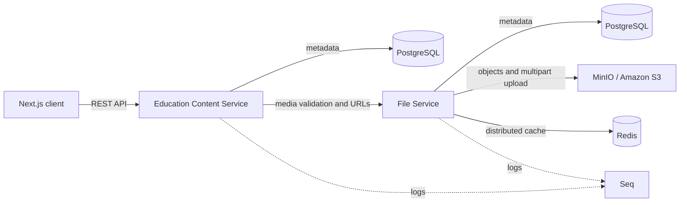

# magomedali.tech — платформа для онлайн-обучения

Full-stack pet-проект образовательной платформы с отдельными сервисами для управления учебным контентом и медиафайлами. Проект показывает мой подход к проектированию прикладной архитектуры, разработке API, работе с данными и созданию современного пользовательского интерфейса.

> **Статус:** активная разработка. Сейчас реализован основной контур управления уроками и связанными с ними видеоматериалами.

## Кратко для резюме

Разрабатываю full-stack платформу для онлайн-обучения на **.NET 10 и Next.js 16**. Спроектировал сервисы учебного контента и файлового хранилища, реализовал REST API, межсервисную проверку медиа, multipart-загрузку файлов напрямую в S3-совместимое хранилище, кэширование URL в Redis и клиентскую часть с поиском, фильтрацией и бесконечной прокруткой. Для хранения данных использую PostgreSQL и EF Core, для наблюдаемости — Serilog и Seq, для проверки критичных сценариев — xUnit и Testcontainers.

## Что реализовано

### Web-клиент

- каталог активных и удалённых уроков;
- создание урока с привязкой ранее загруженного видео;
- поиск по названию с debounce;
- серверная пагинация и бесконечная прокрутка через `IntersectionObserver`;
- сохранение фильтров между сессиями;
- валидация форм и единая обработка ошибок API;
- состояния загрузки, skeleton-интерфейс, уведомления и повтор запросов;
- адаптивный интерфейс на основе Tailwind CSS и shadcn/ui.

### Education Content Service

- создание, чтение, редактирование и soft delete уроков;
- пагинация, фильтрация и поиск;
- проверка существования и типа видео через File Service перед созданием урока;
- доменные сущности и value objects для защиты бизнес-инвариантов;
- валидация входных данных через FluentValidation;
- EF Core migrations и PostgreSQL;
- REST API и интерактивная документация Swagger/OpenAPI.

### File Service

- multipart-загрузка больших файлов по presigned URL;
- динамический расчёт размера частей файла;
- хранение метаданных и статусов медиа в PostgreSQL;
- работа с Amazon S3 API и локальным MinIO;
- выдача временных ссылок на скачивание;
- локальный и распределённый кэш presigned URL через HybridCache и Redis;
- одиночное и пакетное получение информации о медиафайлах.

### Общая инфраструктура

- единый формат успешных ответов и ошибок API;
- централизованная обработка исключений;
- correlation ID для связывания событий одного запроса в логах;
- структурированные логи через Serilog и просмотр событий в Seq;
- Docker Compose для PostgreSQL, MinIO, Redis и Seq;
- переиспользуемые библиотеки `SharedKernel`, `Core` и `Framework`.

## Архитектура



Backend разделён на независимые слои `Domain`, `Core`, `Infrastructure`, `Contracts` и `Web`. Прикладные сценарии организованы вертикальными срезами: endpoint, валидация и handler находятся рядом. Ожидаемые ошибки возвращаются как типизированный `Result`, а исключения обрабатываются единым middleware.

## Технологии

| Область | Технологии |
| --- | --- |
| Backend | C#, .NET 10, ASP.NET Core Minimal API, EF Core, FluentValidation |
| Frontend | TypeScript, React 19, Next.js 16, Tailwind CSS 4, shadcn/ui |
| Работа с данными | TanStack Query, Zustand, React Hook Form, Zod, Axios |
| Хранение | PostgreSQL, Amazon S3 API, MinIO, Redis, HybridCache |
| Наблюдаемость | Serilog, Seq, correlation ID, Swagger/OpenAPI |
| Тестирование | xUnit, WebApplicationFactory, Testcontainers |
| Инфраструктура | Docker, Docker Compose, NuGet |

## Тестирование

В проекте есть unit- и integration-тесты для наиболее важных сценариев:

- создание уроков и проверка связанных видео;
- получение и пагинация списка уроков;
- полный multipart upload через S3-совместимое хранилище;
- генерация и кэширование presigned URL;
- расчёт размера частей файла;
- HTTP-контракт взаимодействия между сервисами.

Integration-тесты поднимают изолированные PostgreSQL и MinIO через Testcontainers и проверяют приложение через реальный HTTP pipeline.

## Структура репозитория

```text
magomedali-tech/
├── client/                         # Next.js-приложение
├── backend/
│   ├── EducationContentService/    # Управление уроками и учебным контентом
│   ├── FileService/                # Загрузка и выдача медиафайлов
│   └── Shared/                     # Общие backend-компоненты
├── scripts/                        # Вспомогательные SQL-скрипты
└── docker-compose-dev.yml          # Локальная инфраструктура
```

## Локальная разработка

Необходимы **.NET 10 SDK**, **dotnet-ef**, **Node.js 20+** и **Docker**. Для восстановления приватных пакетов `Magomedali.*` также нужен GitHub Packages token в переменной `GH_PACKAGES_TOKEN`.

Сначала запустите локальную инфраструктуру и примените миграции:

```powershell
docker compose -f docker-compose-dev.yml up -d postgres minio redis seq

dotnet ef database update `
  --project backend/EducationContentService/EducationContentService.Infrastructure.Postgres `
  --startup-project backend/EducationContentService/EducationContentService.Web

dotnet ef database update `
  --project backend/FileService/FileService.Infrastructure.Postgres `
  --startup-project backend/FileService/FileService.Web
```

Затем запустите приложения в отдельных терминалах:

```powershell
# File Service
$env:S3Options__Endpoint = "http://localhost:9000"
$env:S3Options__AccessKey = "minioadmin"
$env:S3Options__SecretKey = "minioadmin"
dotnet run --project backend/FileService/FileService.Web

# Education Content Service
dotnet run --project backend/EducationContentService/EducationContentService.Web

# Web-клиент
cd client
npm ci
npm run dev
```

После запуска:

- клиент — [http://localhost:3000](http://localhost:3000);
- Education Content Service — [http://localhost:8001/swagger](http://localhost:8001/swagger);
- File Service — [http://localhost:8002/swagger](http://localhost:8002/swagger);
- Seq — [http://localhost:8081](http://localhost:8081);
- MinIO Console — [http://localhost:9002](http://localhost:9002).

Контейнерный вариант Education Content Service доступен на порту `9001`; его параметры можно переопределить через файл `education.service.env` на основе `education.service.env.example`.

## Автор

**Магомедали Гаджиев** — backend / full-stack разработчик.

- GitHub: [MagomedaliGajiev](https://github.com/MagomedaliGajiev)
